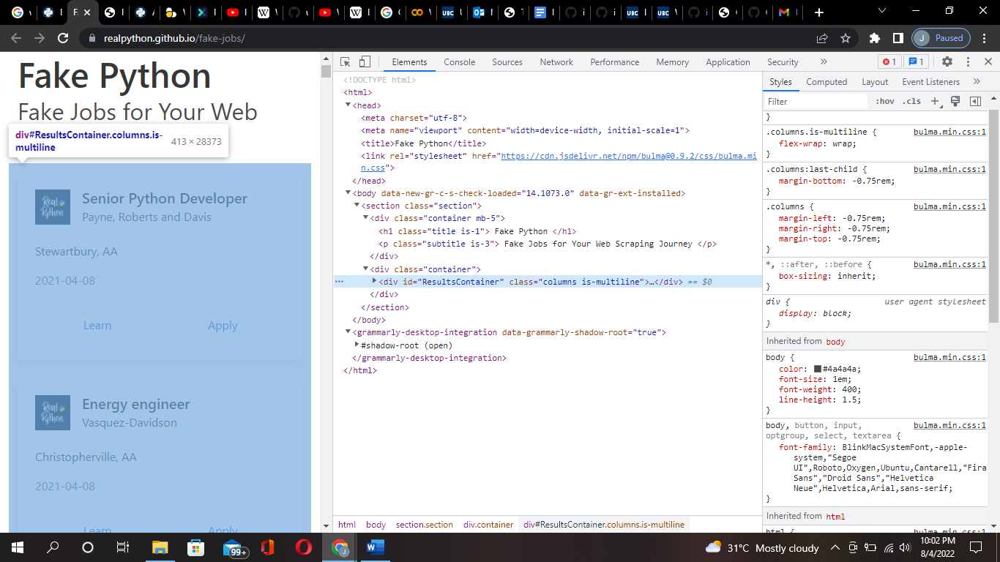

# Activities

For this tutorial a web scraper for Fake Job site (https://realpython.github.io/fake-jobs/) will be created.

## Step 1: Inspect Data Source

The first step is to explore the website and know what contents to scrape in it. The job postings are structured in a card format, and each of them has two buttons. A new page with detailed job description appears when the Apply button is clicked. Notice, the URL in the browser’s address bar changes when you interact with the website.

Inspect the site with developer tools (Ctrl+shift+I) to observe the site’s document object model (DOM) to understand the source. To dig into your page’s DOM, select the Elements tab in developer tools. You’ll see a structure with clickable HTML elements. You can expand, collapse, and even edit elements right in your browser. You can also hover over the HTML text on your right and see the corresponding elements light up on the left.

## Step 2: Scrape the page’s HTML content

First, you’ll want to get the site’s HTML code into your Python script so that you can interact with it. To fulfill this task, you’ll use Python’s requests library.
Type the following command in your terminal to install the external requests library:

Input
{: .label .label-green }
~~~python
pip install requests
~~~

Afterwards, import the requests library:

Input
{: .label .label-green }
~~~python
import requests
~~~

Then open up a new file in your favorite text/editor or google colab. All you need to retrieve the HTML are a few lines of code:

Input
{: .label .label-green }
~~~python
fake_jobs_page = requests.get("https://realpython.github.io/fake-jobs/")
print(fake_jobs_page.text)
~~~

This code issues an HTTP GET request to the given URL. It retrieves the HTML data that the server sends back and stores that data in a Python object.
By printing the .text attribute of page, gives the same HTML that was inspected earlier with the browser’s developer tools. This successfully grabs the static site content from the Internet! You now have access to the site’s HTML from within your Python script.

## Step 3: Parse HTML code with Beautiful Soup

The HTML code is messy containing various elements, attributes, JavaScript etc. With the help of python, it’s possible to parse this lengthy code and clean it to retrieve the desired data.
Beautiful Soup is a Python library for parsing structured data. It allows the user to interact with HTML just as someone would interact with a web page via developer tools. The library exposes a couple of intuitive functions you can use to explore the HTML you received. To get started, install Beautiful Soup:

Input
{: .label .label-green }
~~~python
pip install beautifulsoup4
~~~

Then, the library is imported in the script and a Beautiful Soup object is generated:

Input
{: .label .label-green }
~~~python
from bs4 import BeautifulSoup

fake_jobs_page = requests.get("https://realpython.github.io/fake-jobs/")
soup = BeautifulSoup(fake_jobs_page.content, "html.parser")
~~~

By adding the two lines of code, a Beautiful Soup object is generated that takes fake_jobs_page.content, which is the HTML content you scraped earlier, as its input. The second argument, "html.parser", ensures that the parser is for the HTML content.

## Find Elements by ID

In an HTML web page, every element has an unique id attribute assigned to them. You can begin to parse the page by selecting a certain element by its ID. Beautiful Soup helps you to find that HTML element by its ID. We are interested in looking for is a 
 with an id attribute that has the value "ResultsContainer".This is implemented in Beautifulsoup using the following code:

Input
{: .label .label-green }
~~~python
results = soup.find(id="ResultsContainer")
~~~

By calling .prettify() on the results variable of any Beautiful Soup object, you can easily see all the HTML contained within the 
:

Input
{: .label .label-green }
~~~python
print(results.prettify())
~~~

When choosing element’s by ID we precisely get to choose one element among the rest of the bunch.

## Find Elements by HTML Class Name   

The job postings are wrapped in a 
 element with the class card-content. Now you can work with your new object called results and select only the job postings in it. These are, after all, the parts of the HTML that you’re interested in! You can do this in one line of code:

Input
{: .label .label-green }
~~~python
jobs = results.find_all("div", class_="card-content")
~~~

The .find_all() on a Beautiful Soup object returns an iterable containing all the HTML for all the job listings displayed on that page.Take a look at all of them:

Input
{: .label .label-green }
~~~python
for job in jobs:
  print(job, end="\n"*2)
~~~

Although it’s neat there’s still a lot of HTML! You saw earlier that your page has descriptive class names on some elements. You can pick out those child elements from each job posting with .find():

Input
{: .label .label-green }
~~~python
for job in jobs:
    title = job.find("h2", class_="title")
    company = job.find("h3", class_="company")
    print(title)
    print(company)
    print()
~~~

Each job is another BeautifulSoup() object. Therefore, you can use the same methods on it as you did on its parent element, results.

